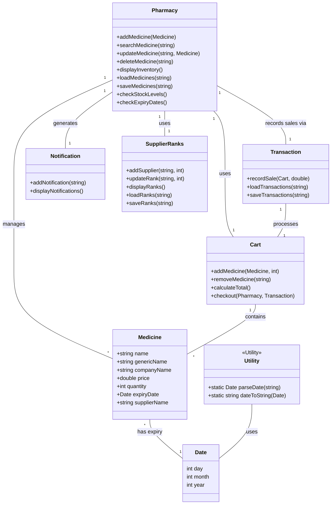

# Pharmacy Management System (Pharmasync)

This project is a simple command-line based Pharmacy Management System implemented in C++.

## Features

*   Add, search, update, and delete medicines.
*   Manage medicine stock and expiry dates.
*   Process customer purchases using a cart system.
*   Generate transaction records.
*   Manage supplier information and ranks.
*   Provide notifications for low stock and expiring medicines.

## Compilation and Execution

1.  **Compile the main application:**
    ```bash
    g++ main.cpp pharmacy.cpp medicine.cpp supplier_ranks.cpp cart.cpp notification.cpp transaction.cpp utility.cpp -o pharmasync.exe
    ```
2.  **Run the application:**
    ```bash
    ./pharmasync.exe
    ```
3.  **Compile the tests (Optional):**
    ```bash
    g++ -o pharmacy_test.exe Tests/pharmacy_test.cpp pharmacy.cpp medicine.cpp cart.cpp notification.cpp supplier_ranks.cpp utility.cpp
    ```
4.  **Run the tests (Optional):**
    ```bash
    ./pharmacy_test.exe
    ```

## Project Structure

*   `main.cpp`: Main entry point of the application.
*   `medicine.h/.cpp`: Defines the `Medicine` class.
*   `pharmacy.h/.cpp`: Defines the `Pharmacy` class (manages medicines).
*   `cart.h/.cpp`: Defines the `Cart` class for handling customer purchases.
*   `transaction.h/.cpp`: Defines the `Transaction` class for recording sales.
*   `notification.h/.cpp`: Defines the `Notification` class for alerts.
*   `supplier_ranks.h/.cpp`: Defines the `SupplierRanks` class.
*   `utility.h/.cpp`: Contains utility functions (e.g., date handling).
*   `date_utility.h`: Header for date-related utilities.
*   `medicine_data.txt`: Stores medicine inventory data.
*   `transaction.txt`: Stores transaction history.
*   `supplier_ranks.txt`: Stores supplier ranking data.
*   `Tests/`: Contains test files.
*   `commands.txt`: Contains compilation commands.

## Class Diagram (Conceptual)



*(Note: This is a simplified representation. Relationships might be more complex in the actual implementation.)*